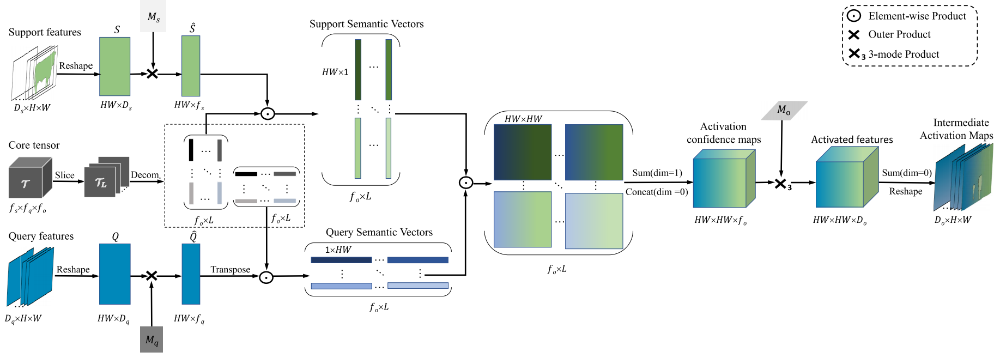
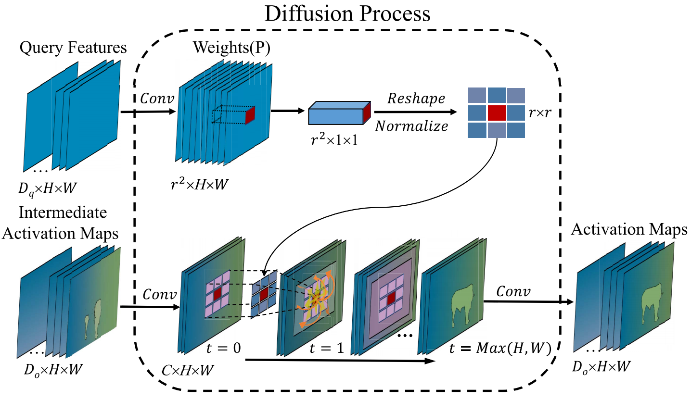

HFA: Harmonic Feature Activation for few-shot semantic segmentation

Core Modules of HFA

## Introduction  
Few-shot semantic segmentation aims at training a model which segments the novel class with few training data. We propose harmonic feature activation to effectively activate the target category in query image.  
   
   

## Innovation  
The Bilinear_Activation_slice module could be used for feature fusion.  
The Semantic Diffusion module can be plugged before segmentation modules to refine the feature maps.  

## Getting started
### Requirements  
pytorch>=1.0  
python>=3.6  
numpy  
pillow  
opencv  

### Data preparation  
PASCAL VOC dataset  
MS COCO dataset

### Train & Test  
run main.ipynb  

### Model zoo  
Please kindly refer to [here](https://github.com/Bibikiller/HFA/edit/master/README.md)  

## License  
[MIT license](https://github.com/Bibikiller/HFA/edit/master/LICENSE)  

## References
Part of our codes are based on the following repositories:  
DEEPLAB-XCEPTION: https://github.com/jfzhang95/pytorch-deeplab-xception  

